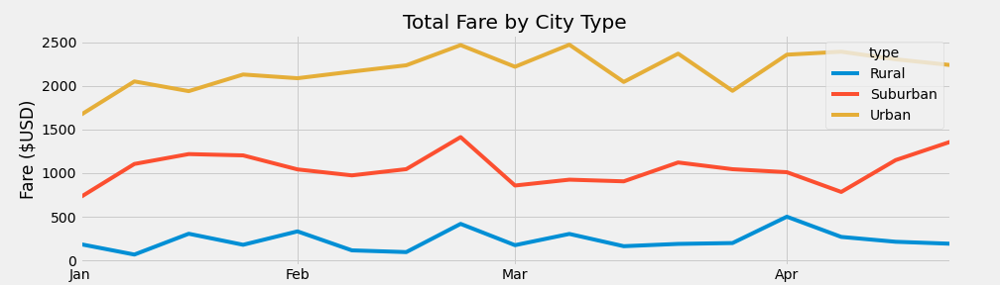
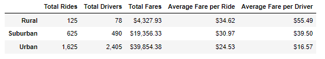

# PyBer_Analysis

## Overview of the Analysis
The purpose of the analysis was to review the fare information for cities, based on the city type using python and graphs. We were required to first identify summary data for total rides, total drivers and total fares, all grouped by the type of city. following this, we were able to get averages for each city type and display this into a dataframe within python. we also utilized the index function and formatting to clean up tables.

The second part of this analysis consisted of creating a line graph within python using the matplotlib function. In order to do this, we utilized a variety of python functions including index, pivot, loc and resample. 

## Results
The results of the data show that urban fares are usually hire every week than suburban and rural fares. the rural fares are the lowest. In February, there was an increase in fares closer to the end of the month for all city types. 

The PyBer summary for total fares, average fares per ride and average fares per Driver for each of the city types can be found in the following chart:

## Summary
Based on the results, I would recommend the following three business recommendations

  * Data for Rural areas is extremely low, which may be due to the rural cities being more spread out. It would be interesting to note how many miles on average each of these cities are clocking. There are plently of drivers in the Urban area. on average, how many miles are these drivers compared to those in the rural areas?
  * What time of day are the rides being scheduled? this would be helpful to know where and when we can increase the number of drivers to get the most profit
  * This data only shows from Jan 2019 - April 2019. Look at the whole year to see how the full year trends and when the most rides occur in each city type. Additionally, doing a year-over-year analysis may help provide more insite into which months rides are being used more

